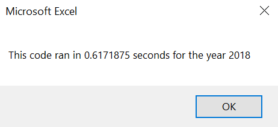
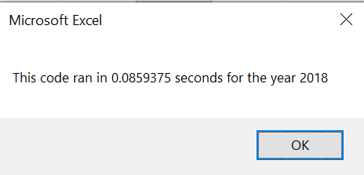

#Stock Analysis with VBA in Excel
## Overview of Project
The goal of this project was to refactor a Microsoft Excel VBA Code to assess stock data such as ticker, total daily volume, and return from 2018.  The refactored code would run the VBA script faster compared to the initial code.  As a result, this would lead to a more efficient code by using less steps.

## Results
The following is the refactored code with instructional comments:

    '1a) Create a ticker Index
    tickerIndex = 0

    '1b) Create three output arrays
    Dim tickerVolumes(12) As Long
    Dim tickerStartingPrices(12) As Single
    Dim tickerEndingPrices(12) As Single
    
    ''2a) Create a for loop to initialize the tickerVolumes to zero.
    For i = 0 To 11
        tickerVolumes(i) = 0
    Next i
    
    ''2b) Loop over all the rows in the spreadsheet.
    For i = 2 To RowCount
    
        '3a) Increase volume for current ticker
        tickerVolumes(tickerIndex) = tickerVolumes(tickerIndex) + Cells(i, 8).Value
        
        '3b) Check if the current row is the first row with the selected tickerIndex.
        'If  Then
        If Cells(i - 1, 1).Value <> tickers(tickerIndex) And Cells(i, 1).Value = tickers(tickerIndex) Then
            tickerStartingPrices(tickerIndex) = Cells(i, 6).Value
        End If

            
        'End If
        
        '3c) check if the current row is the last row with the selected ticker
         'If the next row’s ticker doesn’t match, increase the tickerIndex.
        'If  Then
        If Cells(i + 1, 1).Value <> tickers(tickerIndex) And Cells(i, 1).Value = tickers(tickerIndex) Then
            tickerEndingPrices(tickerIndex) = Cells(i, 6).Value
        End If
            

        '3d Increase the tickerIndex.
        If Cells(i + 1, 1).Value <> tickers(tickerIndex) Then
            tickerIndex = tickerIndex + 1
        End If
            
        'End If
    
    Next i
    
    '4) Loop through your arrays to output the Ticker, Total Daily Volume, and Return.
    For i = 0 To 11
        
        Worksheets("All Stocks Analysis").Activate
        Cells(4 + i, 1).Value = tickers(i)
        Cells(4 + i, 2).Value = tickerVolumes(i)
        Cells(4 + i, 3).Value = tickerEndingPrices(i) / tickerStartingPrices(i) - 1
        
    Next i
  
The initial code had a run time of 0.6171875 seconds. 

On the other hand, the refactored code has a faster run time of 0.0859375 seconds.  

## Summary
- What are the advantages or disadvantages of refactoring code?  Refactoring can make the code more organized and have a faster run time.  However, it is time consuming to understand the initial code and research how to make it more efficient.

- How do these pros and cons apply to refactoring the original VBA script? The refactored code has a faster run time compared to the previous code! However, it did take some time and research on how to make this code only loop through the data once instead of having it loop through multiple times with the previous code.
